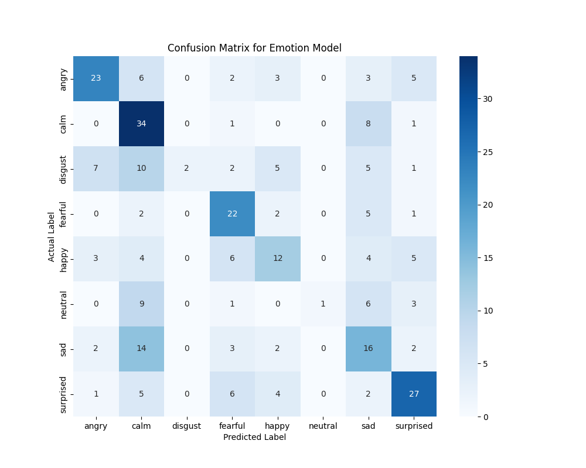

# 👨‍🦳 Age and Emotion Detection from Voice 🎤

This project is a machine learning application built with Python and Streamlit that analyzes a voice note to determine the speaker's age and emotion. The application is specifically designed to process **male voices** and applies special logic for senior citizens.


## 📋 Problem Statement

The goal is to create a complete system with a graphical user interface (GUI) that performs the following tasks from an audio input:
1.  **Gender Verification**: First, it verifies if the voice is male. If a female voice is detected, the input is rejected with a message.
2.  **Age Prediction**: If the voice is male, the model predicts the speaker's age.
3.  **Emotion Recognition (Conditional)**: If the predicted age is over 60, the speaker is marked as a senior citizen, and a separate model is used to detect their emotion (e.g., happy, sad, angry).


## ⚙️ Tech Stack & Libraries

* **Language**: Python 3.10+
* **GUI**: Streamlit
* **Machine Learning**: Scikit-learn
* **Audio Processing**: Librosa
* **Data Handling**: Pandas, NumPy


## 💾 Dataset

This project uses the **Ryerson Audio-Visual Database of Emotional Speech and Song (RAVDESS)**.

* **Download Link**: You can download the dataset from [Zenodo](https://zenodo.org/records/1188976). You will need the `Audio_Speech_Actors_01-24.zip` file.

#### Important Note on Data
To make this project self-contained and focus on the core logic, the labels for **gender** and **age** were synthetically derived from the RAVDESS dataset's file naming convention:
* **Gender**: Determined by the actor's ID (odd-numbered actors are labeled male, even-numbered are female).
* **Age**: A synthetic age was assigned to each actor to demonstrate the regression model's functionality. In a real-world scenario, you would use a dataset with explicit age labels like Mozilla Common Voice.


## 🧠 Methodology & Visualizations

The project's logic is powered by a pipeline of feature extraction and machine learning models. Visualizations are crucial for understanding both the data and the model's performance.

#### 1. Feature Extraction
For all audio files, **Mel-Frequency Cepstral Coefficients (MFCCs)** are extracted as the primary features using the `librosa` library. MFCCs are an industry-standard feature for audio processing as they mimic the way humans perceive sound, making them highly effective for voice-related tasks.

#### 2. Data Distribution
Before training, the distribution of emotions in the dataset was analyzed. Ensuring a balanced dataset is a critical first step in machine learning, as it prevents the model from becoming biased towards the most frequently occurring classes.


#### 3. Model Performance
A confusion matrix was used to evaluate the performance of the Emotion Classification model. The diagonal axis shows the number of correct predictions, while off-diagonal cells highlight where the model gets confused (e.g., mistaking 'sad' for 'calm'). This insight is vital for targeted model improvement.

### Confusion Matrix : 


## 🚀 Setup and Installation Guide

Follow these steps to get the project running on your local machine.

#### Step 1: Clone the Repository
```bash
git clone [https://github.com/Mr-J12/age-and-emotion-detection-through-voice.git]
cd age-and-emotion-detection-through-voice
```

#### Step 2: Set Up the Dataset
1.  Download the `Audio_Speech_Actors_01-24.zip` file from the [RAVDESS dataset link](https://zenodo.org/records/1188976).
2.  Unzip the file.
3.  Move all the `Actor_...` folders into the `data/` directory inside your project folder. The final structure should look like this:
    ```
    voice_detector/
    ├── data/
    │   ├── Actor_01/
    │   ├── Actor_02/
    │   └── ... (and so on)
    ├── app.py
    └── ...
    ```

#### Step 3: Install Dependencies
Install all the required Python packages using the `requirements.txt` file.
```bash
pip install -r requirements.txt
```

#### Step 4: Train the Models
Run the training script to process the audio data and create the models. This will save the model files (`.pkl`) in the `saved_models/` directory.
```bash
python train_models.py
```

#### Step 5: Run the Streamlit Application
Launch the web application using Streamlit. Your default web browser will open with the GUI.
```bash
streamlit run app.py
```
You can now upload a `.wav` file from one of the male actor folders (e.g., `Actor_01`, `Actor_03`) to test the application!


## 📁 Project Structure
```
.
├── data/                 # Folder to store the RAVDESS actor folders
├── saved_models/         # Trained models will be saved here
├── app.py                # The main Streamlit application script
├── train_models.py       # Script for data processing and model training
├── requirements.txt      # List of Python dependencies for the project
└── README.md             # You are here!
```
